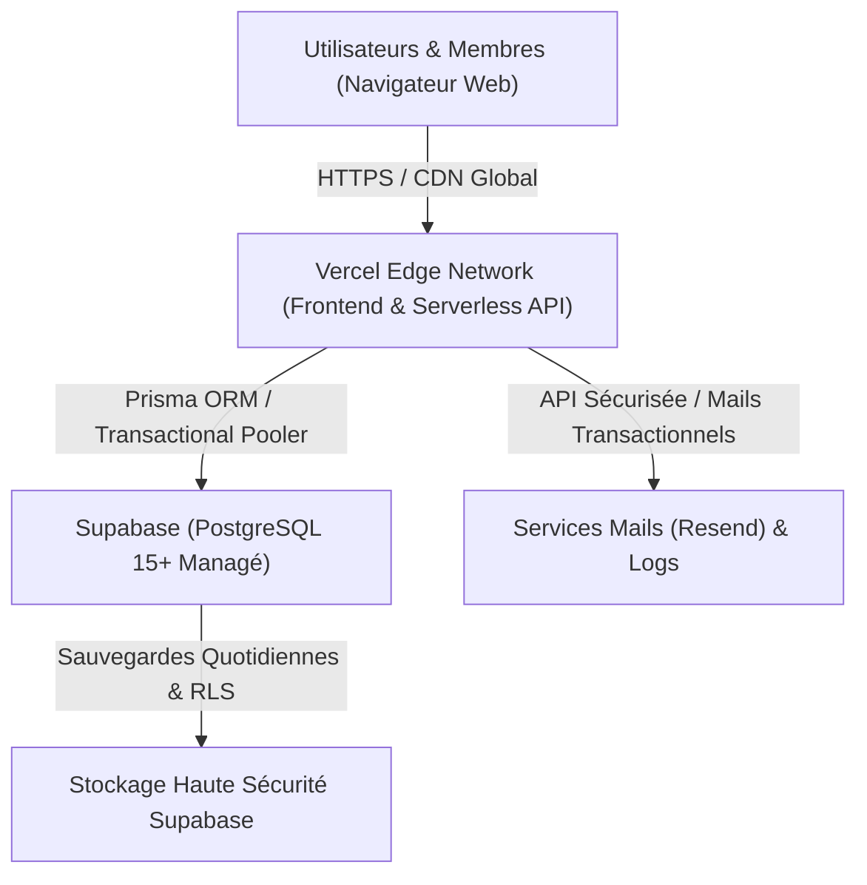
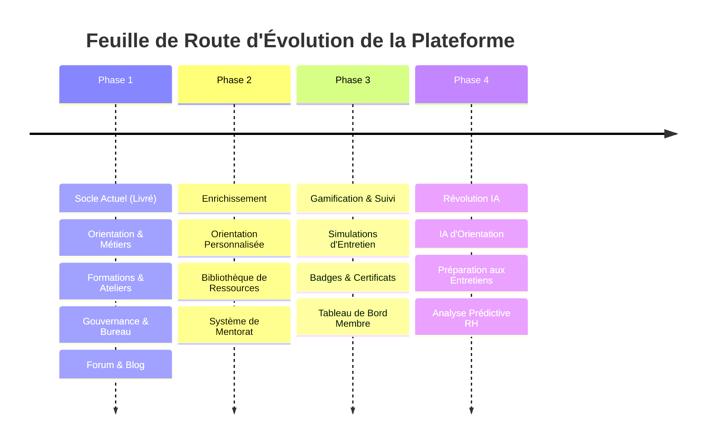

# 🚀 DOSSIER DE PRÉSENTATION OFFICIEL
## Plateforme Numérique « LE MONDE DU TRAVAIL »
### *« Demain se prépare aujourd'hui. »*

> **URL Officielle de la Plateforme :** [https://monde-du-travail.vercel.app](https://monde-du-travail.vercel.app)  
> **Date de Présentation :** 16 Septembre 2026  
> **Public Cible :** Membres, Bureau Exécutif & Partenaires du Club

---

## 1. 🌟 Introduction & Vision Stratégique

### 1.1 Le Constat de Départ
Le monde professionnel contemporain évolue à une vitesse fulgurante. Les jeunes étudiants et diplômés font face à trois obstacles majeurs :
1. **Un déficit critique d'orientation concrète** : Méconnaissance des métiers porteurs en Afrique (Tech, Cybersécurité, Énergies renouvelables, Fintech, etc.).
2. **L'absence de préparation aux compétences humaines (Soft Skills)** : Manque d'assurance à l'oral, difficultés à structurer un projet, absence de réseau professionnel.
3. **Le manque d'espace d'échange structuré** : Isolement face aux choix académiques et professionnels.

### 1.2 Notre Réponse : Une Plateforme 5-en-1
Le club **Le Monde du Travail** a conçu et déployé une plateforme web collaborative de pointe, combinant harmonieusement :
$$\text{Orientation} + \text{Formation} + \text{Information} + \text{Communauté} + \text{Technologie}$$

> [!IMPORTANT]
> **Objectif Fondamental :**  
> Démocratiser l'accès aux opportunités de carrière, développer le leadership citoyen et équiper chaque membre des outils nécessaires pour réussir son insertion professionnelle.

---

## 2. 🏛️ Présentation Détaillée du Site & Fonctionnalités

La plateforme a été pensée comme une expérience fluide, rapide et intuitive pour les jeunes comme pour les professionnels.

### 2.1 Accueil & Mesure d'Impact en Temps Réel
- **Bannière d'accroche immersive** : Identité visuelle forte, appel à l'action clair vers l'adhésion et l'orientation.
- **Compteurs d'impact dynamiques & véridiques** :
  - **12+** Formations & Ateliers pratiques animés.
  - **14+** Fiches métiers spécialisées et guides de carrière.
  - Discussions et retours d'expérience communautaires.
  - Membres actifs et réseau de mentors.

---

### 2.2 Espace « Métiers & Orientation »
L'orientation ne doit plus reposer sur le hasard. La section Métiers offre des fiches exhaustives et pragmatiques adaptées aux réalités du marché africain et international.

- **Filtres par domaines d'avenir** : Technologies du numérique, Cybersécurité, Énergies renouvelables, Finance & Comptabilité, Santé, etc.
- **Détails de chaque fiche** :
  - Description du quotidien professionnel et missions types.
  - Fourchettes de salaires indicatifs (débutant / expérimenté).
  - Compétences techniques et humaines indispensables.
  - Parcours d'études recommandés et passerelles.
  - Avantages et contraintes du métier.

---

### 2.3 Espace « Formations & Ateliers Pratiques »
Des modules concrets pour transformer le potentiel académique en compétences opérationnelles.

- **Modules phares dispensés** :
  - *Prise de parole en public & Éloquence*
  - *Leadership & Management collaboratif*
  - *Initiation à la Cybersécurité & Hygiène numérique*
  - *Entrepreneuriat & Montage de projets*
  - *Développement personnel & Gestion du stress*
- **Transparence pédagogique** : Objectifs de formation, public cible, durée, prérequis et syllabus détaillé.

---

### 2.4 Espace « Blog, Veille & Actualités »
Un média éditorial interne qui décrypte l'actualité du monde professionnel, partage des conseils pratiques et met en lumière les réussites du club.

- Articles d'analyse sur les métiers de demain en Afrique.
- Témoignages inspirants de membres ayant progressé grâce au club.
- Annonces officielles des sessions de formation et des rassemblements.

---

### 2.5 Forum Communautaire d'Entraide
Un espace d'échange respectueux et modéré permettant aux jeunes de poser leurs questions sur leurs choix de filières, stages et projets d'études, et d'obtenir des retours d'expérience précieux.

---

### 2.6 Espace Membre & Adhésion Sécurisée
- **Candidature numérique** : Dépôt du dossier en ligne avec lettre de motivation personnalisée.
- **Accès membre protégé** : Authentification JWT sécurisée, suivi de session et tableau de bord personnel.

---

### 2.7 Espace Administration & Gouvernance Hiérarchique (Staff Technique & Bureau)
La plateforme dispose d'un panneau d'administration professionnel complet avec un système RBAC (*Role-Based Access Control*) :

- **Rôles spécialisés délégués** :
  - `ADMIN_FORMATION` : Gestion du cycle de vie des formations.
  - `ADMIN_METIER` : Rédaction et enrichissement des fiches métiers.
  - `ADMIN_BLOG` : Rédaction et publication d'articles.
  - `ADMIN_FORUM` : Modération et animation des discussions.
- **Sécurité de niveau bancaire** :
  - Double authentification **2FA** (TOTP via Google Authenticator).
  - Journal d'audit temps réel (`AuditLog`) consignant chaque action sensible.
  - Confirmation par mot de passe requise pour toute action critique.
- **Nouvelle Section « Organisation & Fonctionnement » (Gouvernance du Club)** :
  - **Organigramme visuel du bureau** : Bureau Exécutif (Président, VP, Secrétaire Général, Trésorier) et Responsables de Pôles (Communication, Logistique, Pédagogie, Partenariats, Projets, Vie Associative).
  - **Prérogative exclusive Ultra Admin** : Attribution des postes en 1 clic, changement de titulaire à sa guise, personnalisation intégrale des intitulés et missions, suppression sécurisée de postes.

---

## 3. 🛠️ Le Socle Technique : Vercel & Supabase

L'infrastructure a été sélectionnée selon les standards mondiaux du développement web moderne (*Jamstack & Serverless*), garantissant **robustesse**, **sécurité** et **coûts maîtrisés**.

---

### 3.1 Vercel : L'Hébergement & Déploiement Continu

#### Qu'est-ce que Vercel ?
Vercel est la plateforme d'hébergement cloud de référence mondiale, utilisée par des entreprises technologiques majeures pour servir des millions d'utilisateurs avec une rapidité exemplaire.

#### Les Points Forts de Vercel pour le Club :
1. **Réseau CDN Mondial (Edge Network)** : Le site est répliqué sur des serveurs distribués à travers le monde. Temps de chargement quasi-instantané, y compris sur les connexions mobiles au Sénégal et en Afrique.
2. **Déploiement Continu Automatique (CI/CD)** : Chaque amélioration validée sur GitHub est compilée, testée et déployée en production en moins de 60 secondes, **sans interruption de service**.
3. **Disponibilité Maximale (99.99%)** : Zéro maintenance de serveur physique, protection anti-DDoS native et certificats de sécurité HTTPS/SSL renouvelés automatiquement.
4. **Architecture Serverless** : Les fonctions backend (`/api`) s'exécutent à la demande. Le serveur ne consomme de ressources que lorsqu'un utilisateur effectue une requête.

---

### 3.2 Supabase : La Base de Données Relationnelle Managée

#### Qu'est-ce que Supabase ?
Supabase est une plateforme cloud managée offrant la puissance du moteur de base de données relationnelle le plus respecté au monde : **PostgreSQL 15+**.

#### Les Points Forts de Supabase pour le Club :
1. **Intégrité Totale des Données (Prisma ORM)** : Les relations entre membres, formations, métiers, candidatures et postes du bureau sont strictement vérifiées. Zéro risque de perte ou corruption de données.
2. **Pooler Transactionnel (PgBouncer)** : Gestion optimisée des connexions simultanées, évitant toute surcharge lors des pics d'affluence.
3. **Sécurité & Conformité (RLS - Row Level Security)** : Cloisonnement strict des données privées des membres et des données administratives.
4. **Sauvegardes Automatiques Quotidiennes** : Vos données d'adhésion et contenus sont sauvegardés régulièrement et restaurables en cas de sinistre.

---

## 4. 💰 Modèle Économique, Offre Gratuite & Tarifs en FCFA

L'un des plus grands atouts stratégiques de cette architecture réside dans son **modèle financier progressif**.

### 4.1 L'Offre Gratuite (Free Tier) : 0 FCFA pour Démarrer

Pour la phase de lancement et de montée en charge actuelle, **la plateforme fonctionne à 0 FCFA de coût d'hébergement récurrent** grâce aux quotas généreux des offres gratuites de Vercel et Supabase.

| Service | Offre Gratuite (Inclus à 0 FCFA) | Couverture Estimée pour le Club |
|---|---|---|
| **Vercel (Hobby)** | 100 Go de bande passante/mois, HTTPS gratuit, déploiements illimités | Jusqu'à **50 000 à 100 000 visites/mois** |
| **Supabase (Free)** | 500 Mo de base de données PostgreSQL, 50 000 utilisateurs actifs/mois, 1 Go de stockage | Des dizaines de milliers de membres et fiches |
| **Resend (Email)** | 3 000 emails transactionnels/mois gratuits | Validation des inscriptions et notifications |
| **Total Mensuel Initial** | **0 USD / mois** | **0 FCFA / mois** |

> [!TIP]
> **Avantage pour le Club :**  
> Le club n'a aucun frais fixe d'hébergement à payer pendant toute sa phase d'amorçage. L'argent du club peut être concentré à 100% sur l'organisation des ateliers et des événements !

---

### 4.2 Quand et Pourquoi Passer à un Abonnement Payant ?

Le passage aux plans professionnels n'est nécessaire que lorsque le club franchit des seuils de maturité significatifs :

1. **Volume de Membres Élevé** : Dépassement régulier de 50 000 membres actifs ou base de données > 500 Mo.
2. **Besoins Multimédias Massifs** : Hébergement direct de centaines de vidéos de formation haute définition ou de documents volumineux.
3. **Sauvegardes Point-in-Time** : Restauration des données à la minute près (PITR) requise par des audits institutionnels.
4. **Équipe d'Administration Élargie** : Collaboration multi-comptes avec gestion fine des accès équipe sur le cloud Vercel.

---

### 4.3 Grille Tarifaire Officielle & Conversion en FCFA

*Taux de change de référence appliqué : **1 USD = 615 FCFA** (cours moyen UEMOA / XOF).*

| Service | Formule | Prix Officiel ($ USD) | Coût Mensuel en FCFA | Coût Annuel en FCFA |
|---|---|---|---|---|
| **Vercel Pro** | Formule Équipe & Scalabilité | 20 $ / mois | **~12 300 FCFA / mois** | ~147 600 FCFA / an |
| **Supabase Pro** | PostgreSQL Pro & 8 Go DB | 25 $ / mois | **~15 375 FCFA / mois** | ~184 500 FCFA / an |
| **TOTAL INFRASTRUCTURE PRO** | **Vercel Pro + Supabase Pro** | **45 $ / mois** | **~27 675 FCFA / mois** | **~332 100 FCFA / an** |

> [!NOTE]
> **Comparaison avec le marché traditionnel :**  
> Un serveur dédié traditionnel ou un contrat de maintenance d'agence coûte généralement entre **150 000 et 300 000 FCFA par mois**.  
> Avec notre architecture moderne Vercel + Supabase, même en formule professionnelle payante, l'infrastructure complète coûte **moins de 28 000 FCFA par mois**, tout en offrant une sécurité et des performances de standing international.

---

## 5. 🔭 Perspectives d'Évolution (Feuille de Route)

La plateforme a été conçue pour grandir avec le club. Plusieurs fonctionnalités majeures peuvent être déployées progressivement :

### 🎯 1. Orientation Personnalisée
- Questionnaire intelligent en 10 questions permettant à un jeune d'évaluer ses centres d'intérêt, compétences dominantes et préférences de travail.
- Algorithme de recommandation proposant instantanément les 3 métiers les plus adaptés avec les formations associées du club.

### 📚 2. Bibliothèque de Ressources Numériques
- Création d'une médiathèque centralisée regroupant :
  - Guides pratiques de candidature (CV types, lettres percutantes).
  - Documents de synthèse de chaque atelier.
  - Replays vidéos des conférences et webinaires.
  - Répertoire des bourses d'études et opportunités de stages.

### 🧑🏾‍🏫 3. Système de Mentorat Actif
- Mise en relation directe entre les membres du club et des professionnels chevronnés ou d'anciens membres en poste.
- Prise de rendez-vous pour des sessions de conseils de 30 minutes.

### 📝 4. Simulations d'Entretien d'Embauche
- Ateliers interactifs de simulation d'entretien avec fiches d'évaluation.
- Banque des questions pièges les plus posées par les recruteurs et méthodes de réponse (méthode STAR).

### 🏆 5. Système de Progression & Gamification
- **Badges d'engagement** : « Membre Assidu », « Esprit d'Équipe », « Communicant ».
- **Niveaux d'apprentissage** : Débutant → Initié → Leader de Projet.
- **Certificats d'assiduité automatisés** : Attestations officielles téléchargeables en PDF avec QR Code de vérification pour enrichir le CV des étudiants.

### 📊 6. Tableau de Bord de Progression Membre
- Espace personnel permettant à chaque adhérent de suivre ses ateliers complétés, ses compétences acquises et ses objectifs semestriels.

### 🤖 7. Intelligence Artificielle Éducative (À plus long terme)
L'intégration de modèles d'IA avancés (RAG local ou API sécurisée) pour :
- **Conseiller d'orientation virtuel 24/7** répondant aux interrogations des jeunes.
- **Analyseur de CV par IA** formulant des recommandations concrètes d'amélioration.
- **Simulateur d'entretien vocal interactif**.
- **Personnalisation des parcours de formation** selon le niveau d'entrée du membre.

---

## 6. 🎯 Conclusion & Message de Clôture

Le projet **« Le Monde du Travail »** n'est pas simplement un site internet.

C'est la première pierre d'un **écosystème numérique d'envergure** dédié à la réussite professionnelle, à l'émancipation économique et au leadership citoyen de la jeunesse.

### Notre Démarche Pragmatiste :
$$\text{Commencer} \longrightarrow \text{Tester} \longrightarrow \text{Recueillir les besoins} \longrightarrow \text{Améliorer} \longrightarrow \text{Développer la communauté} \longrightarrow \text{Faire évoluer l'infrastructure}$$

Son architecture moderne permet de démarrer immédiatement **sans barrière financière**, tout en ayant la capacité technique d'accueillir des dizaines de milliers d'utilisateurs le jour venu.

---

### 🌟 Notre Vision :
> **« Préparer aujourd'hui les professionnels et les citoyens conscients qui construiront demain. »**

**LE MONDE DU TRAVAIL**  
*Demain se prépare aujourd'hui.*
